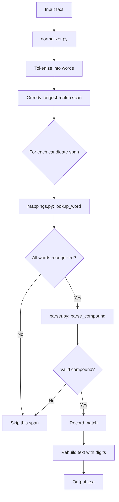
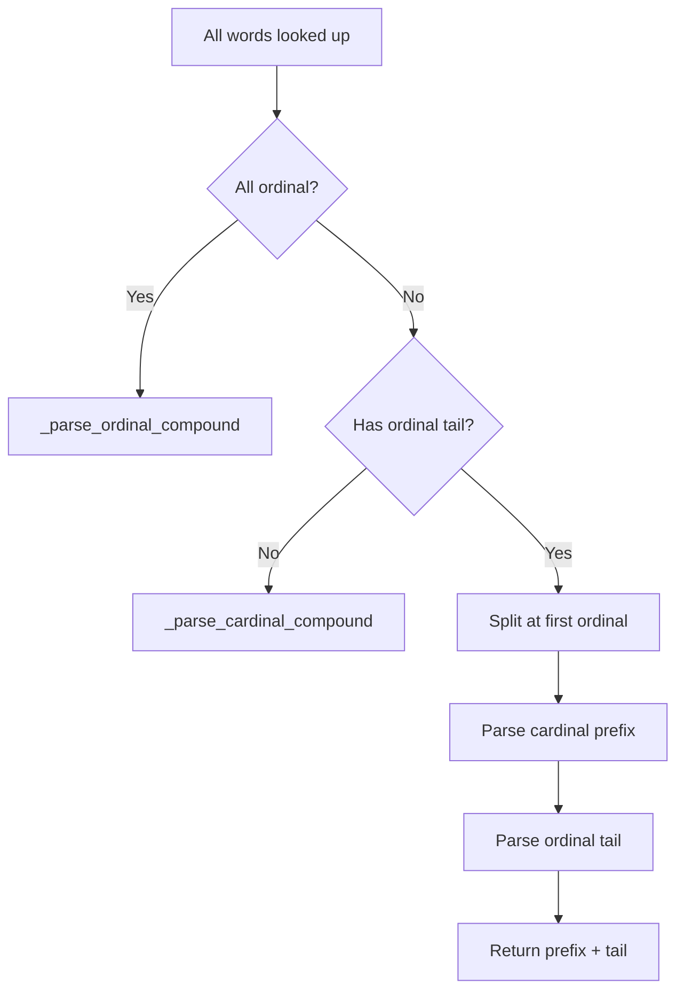
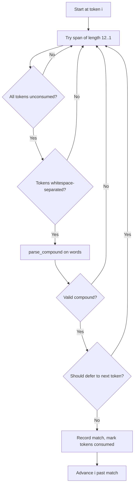

# How the Polish Number Normalizer Works

This document provides a detailed technical description of the three core modules:
[`normalizacja_liczebnikow/mappings.py`](../normalizacja_liczebnikow/mappings.py), [`normalizacja_liczebnikow/parser.py`](../normalizacja_liczebnikow/parser.py), and
[`normalizacja_liczebnikow/normalizer.py`](../normalizacja_liczebnikow/normalizer.py).

---

## Architecture Overview



The system works in three layers:

1. **Mappings** — a dictionary lookup layer that maps Polish number words to their numeric values and grammatical categories
2. **Parser** — a composition engine that assembles individual number words into a single integer value
3. **Normalizer** — a text-processing layer that finds number phrases in running text and replaces them with digits

---

## Module: `normalizacja_liczebnikow/mappings.py`

### Purpose

Provides the dictionary data and lookup functions that map Polish number words — in all their
inflected forms and with or without diacritics — to `(value, category)` tuples.

### Number Categories

Every recognized word is assigned one of six categories:

| Category | Constant | Meaning | Examples |
|---|---|---|---|
| `UNIT` | `'unit'` | 1–9 | jeden, dwa, pięć |
| `TEEN` | `'teen'` | 10–19 | dziesięć, piętnaście |
| `TEN` | `'ten'` | 20–90 | dwadzieścia, pięćdziesiąt |
| `HUNDRED` | `'hundred'` | 100–900 | sto, dwieście, pięćset |
| `THOUSAND` | `'thousand'` | thousand-words | tysiąc, tysięcy, tysiącami |
| `ORDINAL` | `'ordinal'` | ordinal numbers | pierwszy, piąty, setny |

### Data Sources

The module contains four static data dictionaries:

#### `CARDINAL_FORMS` — lines 30–297

Maps a numeric value to a dict of grammatical cases, each containing a list of word forms.
Cases include: `nominative`, `genitive`, `dative`, `accusative`, `instrumental`, `locative`,
`vocative`, `feminine_accusative`, `feminine_instrumental`, `adjective`.

Covers values 0–19, tens 20–90, and hundreds 100–900.

Example:
```python
5: {
    'nominative': ['pięć'],
    'genitive': ['pięciu'],
    'dative': ['pięciu'],
    'accusative': ['pięć'],
    'instrumental': ['pięcioma'],
},
```

#### `THOUSAND_FORMS` — lines 302–309

Groups thousand-words by their grammatical sub-type, which determines what multiplier
is valid before them:

| Sub-type | Words | Valid multiplier |
|---|---|---|
| `singular` | tysiąc, tysiąca, tysiącem, tysiącu, tysiącowi | none — standalone = 1000 |
| `plural_nom_acc` | tysiące | 2–4, excluding 12–14 |
| `plural_gen` | tysięcy | 2+ |
| `plural_inst` | tysiącami | 2+ |
| `plural_dat` | tysiącom | 2+ |
| `plural_loc` | tysiącach | 2+, standalone defaults to 2000 |

#### `ORDINAL_FORMS` — lines 312–372

Maps numeric values to lists of gendered ordinal forms: masculine, feminine, neuter.
Covers 1st–19th, tens 20th–90th, hundreds 100th–900th, thousands 1000th–9000th,
and ten-thousands 10000th–90000th as single-word compound forms.

Example:
```python
5: ['piąty', 'piąta', 'piąte'],
500: ['pięćsetny', 'pięćsetna', 'pięćsetne'],
5000: ['pięciotysięczny', 'pięciotysięczna', 'pięciotysięczne'],
```

#### `ORDINAL_DECLINED_FORMS` — lines 381–394

Additional oblique-case forms of ordinals: genitive, dative, instrumental, locative
etc. for values 1–10, 20, 30.

### Lookup Construction — `_build_lookups` at line 432

Called once at module load. Builds two primary dictionaries:

- **`WORD_TO_INFO`** — maps `lowercase_word → (value, category)` for words with diacritics preserved
- **`WORD_TO_INFO_NODIA`** — maps `diacritics_removed_word → (value, category)` as a fallback

Also builds specialized sets for thousand-word classification:
`THOUSAND_WORDS`, `SINGULAR_THOUSAND_WORDS`, `PLURAL_NOM_ACC_THOUSAND`,
`PLURAL_GEN_THOUSAND`, `PLURAL_INST_THOUSAND`, `PLURAL_DAT_THOUSAND`, `PLURAL_LOC_THOUSAND`.

The helper `_add_word` at line 422 adds each word to both dictionaries, only adding the
non-diacritic version when it differs from the original.

### Public Functions

#### `lookup_word(word)` → `(value, category)` or `None` — line 527

1. Lowercases the input
2. Checks `WORD_TO_INFO` for an exact match with diacritics
3. Falls back to `WORD_TO_INFO_NODIA` after stripping diacritics
4. Returns `None` if neither dictionary contains the word

#### `is_thousand_word(word)` → `bool` — line 538

Checks if a word is any thousand-word form, trying with and without diacritics.

#### `get_thousand_type(word)` → `str` or `None` — line 547

Returns the sub-type string: `'singular'`, `'plural_nom_acc'`, `'plural_gen'`,
`'plural_inst'`, `'plural_dat'`, `'plural_loc'`, or `None`.

#### `valid_thousand_agreement(multiplier, thousand_word)` → `bool` — line 580

Checks whether a numeric multiplier is grammatically compatible with a given
thousand-word form. Implements Polish plural agreement rules:

- `tysiące` requires multiplier ending in 2–4 but not 12–14
- `tysiącach` standalone defaults to 2000
- `tysięcy`, `tysiącami`, `tysiącom` require multiplier ≥ 2

---

## Module: `normalizacja_liczebnikow/parser.py`

### Purpose

Takes a list of already-recognized number words and computes their combined numeric value.
This is the composition engine — it understands how Polish number words combine.

### Entry Point: `parse_compound(words)` — line 9

Accepts a list of word strings. Returns an `int` or `None`.

**Algorithm:**

1. Look up every word via `lookup_word`. If any word is unrecognized, return `None`.
2. Classify the sequence into one of three cases:



#### Case 1: All ordinal — line 27

If every word in the sequence is `ORDINAL`, delegates to `_parse_ordinal_compound`.

Example: `['dwudziesty', 'piąty']` → 25

#### Case 2: Cardinal prefix + ordinal tail — line 30

If some words are cardinal followed by a contiguous ordinal tail, splits the sequence
at the first ordinal word. Parses the cardinal prefix and ordinal tail separately,
then adds them.

Example: `['dwa', 'tysiące', 'dwudziesty', 'piąty']` → cardinal prefix `dwa tysiące` = 2000,
ordinal tail `dwudziesty piąty` = 25, result = 2025.

Requires that all words from the first ordinal onward are also ordinal.

#### Case 3: All cardinal — line 47

Delegates to `_parse_cardinal_compound`.

### `_parse_cardinal_compound(words, infos)` — line 50

The core cardinal composition algorithm. Uses a state-machine approach with three
accumulator variables:

| Variable | Purpose |
|---|---|
| `total` | Accumulated value from thousand-level processing |
| `current` | Sub-total being built within the current thousand-group |
| `last_added` | Tracks what category was last added: `None`, `'unit'`, `'teen'`, `'ten'`, `'hundred'`, `'thousand'` |

**Processing rules for each word:**

| Category | Allowed after | Action |
|---|---|---|
| `HUNDRED` | `None`, `'thousand'` | Add to `current` |
| `TEN` | `None`, `'thousand'`, `'hundred'` | Add to `current` |
| `TEEN` | `None`, `'thousand'`, `'hundred'` | Add to `current` |
| `UNIT` | `None`, `'thousand'`, `'hundred'`, `'ten'` | Add to `current` |
| `THOUSAND` | only once | Multiply `current` by 1000, move to `total` |
| `ORDINAL` | special cases only | See below |

The key constraint is that `last_added` prevents invalid compositions:
- Cannot add a unit after a unit — `"pięć sześć"` is two separate numbers
- Cannot add a teen after a teen — `"dziesięć jedenaście"` is two separate numbers
- Cannot add a ten after a ten — `"dwadzieścia trzydzieści"` is two separate numbers

**Thousand handling:**

When a `THOUSAND` word is encountered:
1. Checks `had_thousand` flag — no double thousand allowed
2. Determines the thousand sub-type via `get_thousand_type`
3. If `current == 0`: standalone thousand — `singular` → 1000, `plural_loc` → 2000
4. If `current > 0`: multiplier + thousand — validates grammatical agreement via `_valid_thousand_agreement`, then `total = current * 1000`
5. Resets `current = 0`, sets `last_added = 'thousand'`

**Ordinal in cardinal context:**

Only valid in two edge cases:
- Sole word — `i == 0 and n == 1`
- After thousand when the ordinal value ≥ 1000 — e.g. `tysięczny` as a thousand-level ordinal

**Final result:** `total + current`

### `_parse_ordinal_compound(values)` — line 149

Works similarly to the cardinal parser but operates on pre-extracted ordinal numeric values.
Uses the same state-machine pattern with `total`, `current`, and `last_added`.

Categorizes each ordinal value via `_ordinal_value_category`:
- 1000 or multiples of 1000 → `THOUSAND`
- 100–900 divisible by 100 → `HUNDRED`
- 20–90 divisible by 10 → `TEN`
- 10–19 → `TEEN`
- 1–9 → `UNIT`

Thousand handling for ordinals: when `current == 0`, the thousand value stands alone;
when `current > 0`, it multiplies `current` by 1000.

Example: `[20, 5]` → `dwudziesty piąty` → 20 + 5 = 25

### `_ordinal_value_category(value)` — line 205

Maps an ordinal numeric value to a composition category, mirroring the cardinal categories.

### `_valid_thousand_agreement(multiplier, ttype)` — line 220

Validates Polish grammatical agreement between a numeric multiplier and the thousand-word form:

- `singular` → always `False` — cannot have a multiplier before singular forms
- `plural_nom_acc` → last digit in {2,3,4} and last two digits not in {12,13,14}
- All other plural forms → multiplier ≥ 2

---

## Module: `normalizacja_liczebnikow/normalizer.py`

### Purpose

The text-processing layer. Finds Polish number phrases embedded in running text and
replaces them with their numeric equivalents.

### Entry Point: `normalize_polish_numbers(text)` — line 8

**Phase 1: Tokenization** — lines 20–26

Uses `re.finditer(r'\w+', text)` to extract all word tokens with their start/end positions.
Each token is a tuple `(start, end, word_text)`.

**Phase 2: Greedy Longest Match** — lines 28–71

Scans left-to-right through tokens. At each position, tries the longest possible span first
(up to 12 words), then shrinks until a valid compound is found.



Key constraints during matching:

1. **No consumed tokens** — any token already part of a match cannot be reused
2. **Whitespace separation** — `_tokens_are_whitespace_separated` ensures all tokens in the span are separated only by whitespace, not by punctuation or other characters
3. **Defer logic** — `_should_defer_match_to_next_token` prevents premature short matches when the next token could extend the number

**Phase 3: Text Reconstruction** — lines 76–101

Rebuilds the text string by replacing matched spans with their numeric values:

1. Iterates through matches left-to-right
2. Copies unchanged text between matches
3. When the previous match is followed by a gap that is pure whitespace, collapses it to a single space
4. Appends the digit string for each match
5. Appends any remaining text after the last match

### `_tokens_are_whitespace_separated(text, tokens, start_idx, end_idx)` — line 104

Checks that every gap between consecutive tokens in the span consists only of whitespace
characters. This prevents matching words separated by hyphens, punctuation, or other
non-whitespace characters as a single compound number.

### `_should_defer_match_to_next_token(text, tokens, start_idx, end_idx)` — line 118

A lookahead heuristic that prevents the greedy matcher from consuming an incomplete
number prefix when the next token would extend it.

Returns `True` in these situations:

1. **Next token is a thousand word** and the current span already contains a thousand word
   and the last token is a cardinal unit/teen/ten/hundred — the current span might be an
   incomplete prefix of a larger thousand expression

2. **Next token is ordinal** and the last token in the current span is also ordinal — the
   ordinals should be combined into one match

This is critical for cases like `"dwadzieścia pięć tysięcy"` where the matcher might
stop at `"dwadzieścia pięć"` = 25 and miss the thousand multiplier.

---

## Complete Example Walkthrough

Input: `"Kupiłem pięćset dwadzieścia trzy jabłka za dwadzieścia złotych."`

### Step 1: Tokenization

| Index | Token | Position |
|---|---|---|
| 0 | Kupiłem | 0–7 |
| 1 | pięćset | 8–15 |
| 2 | dwadzieścia | 16–27 |
| 3 | trzy | 28–32 |
| 4 | jabłka | 33–39 |
| 5 | za | 43–45 |
| 6 | dwadzieścia | 46–57 |
| 7 | złotych | 58–66 |

### Step 2: Greedy Matching

- **i=0**: `Kupiłem` — `lookup_word` returns `None`. Skip.
- **i=1**: Try span `[1..12]` → `[1..7]` → ... → `[1..3]` = `['pięćset', 'dwadzieścia', 'trzy']`
  - `parse_compound` → infos: `[(500, HUNDRED), (20, TEN), (3, UNIT)]`
  - Cardinal parse: `current = 500 + 20 + 3 = 523`, `total = 0`
  - Result: **523** ✓
  - Tokens 1, 2, 3 consumed.
- **i=4**: `jabłka` — not a number. Skip.
- **i=5**: `za` — not a number. Skip.
- **i=6**: Try span `[6..7]` = `['dwadzieścia']`
  - `parse_compound` → `(20, TEN)` → result: **20** ✓
  - Token 6 consumed.
- **i=7**: `złotych` — not a number. Skip.

### Step 3: Reconstruction

- Text before match 1: `"Kupiłem "` → kept as-is
- Match 1 value: `"523"`
- Gap between match 1 end and match 2 start: `" jabłka za "` → kept as-is
- Match 2 value: `"20"`
- Remaining text: `" złotych."` → kept as-is

**Output:** `"Kupiłem 523 jabłka za 20 złotych."`

---

## Diacritics Handling

The [`normalizacja_liczebnikow/diacritics.py`](../normalizacja_liczebnikow/diacritics.py) module provides two functions:

### `remove_diacritics(text)` — line 15

Uses `str.maketrans` with a static mapping table to replace Polish diacritic characters
with their ASCII equivalents: ą→a, ć→c, ę→e, ł→l, ń→n, ó→o, ś→s, ź→z, ż→z, and
uppercase equivalents.

### `normalize_for_comparison(text)` — line 20

A text normalization pipeline for comparing texts:

1. Remove Polish diacritics
2. Lowercase all characters
3. Remove all punctuation **except** period, comma, and question mark
4. Remove whitespace before retained punctuation — e.g. `"hello , world"` → `"hello, world"`
5. Deduplicate whitespace to single spaces
6. Strip leading/trailing whitespace

This function is designed so that semantically equivalent texts with different formatting
produce the same output string.
