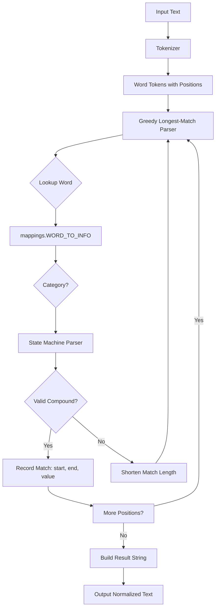
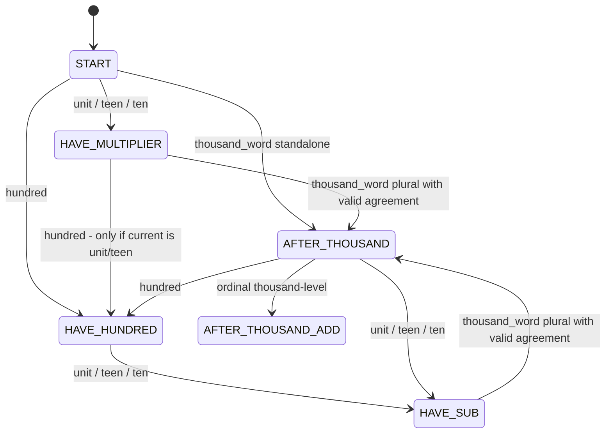

# Polish Number Normalizer - Architecture Plan

## Overview

A Python library that normalizes Polish number words (cardinal and ordinal, range 0–99999) in text, replacing them with their digit representations. Handles all Polish grammatical cases (nominative, genitive, accusative, dative, instrumental, locative, vocative), gender variants, and input with or without Polish diacritics.

## Architecture Diagram



## Module Design

### File Structure

```
src/
  __init__.py           # Exports normalize_polish_numbers
  diacritics.py         # Diacritic removal and text normalization
  mappings.py           # All number-word dictionaries
  parser.py             # Compound number state-machine parser
  normalizer.py         # Main normalize_polish_numbers function
tests/
  ...                   # Existing test files
main.py                 # Entry point
```

### 1. `src/diacritics.py`

**Purpose**: Handle Polish diacritic characters and text normalization for comparison.

**Functions**:

- `remove_diacritics(text: str) -> str` — Replace Polish diacritic characters with ASCII equivalents using a character map.
- `normalize_for_comparison(text: str) -> str` — Fully normalize text for comparison purposes:
  1. Remove Polish diacritics
  2. Lowercase all characters
  3. Remove punctuation
  4. Deduplicate whitespace
  5. Trim whitespace from beginning and end

**Data**:

```python
DIACRITIC_MAP = {
    'ą': 'a', 'ć': 'c', 'ę': 'e', 'ł': 'l', 'ń': 'n',
    'ó': 'o', 'ś': 's', 'ź': 'z', 'ż': 'z',
    'Ą': 'A', 'Ć': 'C', 'Ę': 'E', 'Ł': 'L', 'Ń': 'N',
    'Ó': 'O', 'Ś': 'S', 'Ź': 'Z', 'Ż': 'Z',
}
```

### 2. `src/mappings.py`

**Purpose**: Store all number word forms mapped to their values and categories.

**Data Structures**:

```python
class WordInfo(NamedTuple):
    value: int       # The numeric value
    category: str    # 'unit', 'teen', 'ten', 'hundred', 'thousand_word', 'ordinal'

# Main lookup: word (lowercase, with diacritics) -> WordInfo
WORD_TO_INFO: Dict[str, WordInfo] = {}

# Auto-built: word (lowercase, without diacritics) -> WordInfo
WORD_TO_INFO_NODIA: Dict[str, WordInfo] = {}
```

**Category Definitions**:

| Category | Values | Examples |
|----------|--------|----------|
| `unit` | 1–9 | jeden, dwa, trzy, ... + all case/gender forms |
| `teen` | 10–19 | dziesięć, jedenaście, ... + all case forms |
| `ten` | 20–90 | dwadzieścia, trzydzieści, ... + all case forms |
| `hundred` | 100–900 | sto, dwieście, trzysta, ... + all case forms |
| `thousand_word` | 1000 marker | tysiąc, tysiące, tysięcy, ... + all case forms |
| `ordinal` | 1–90000 | pierwszy, setny, tysięczny, ... + all gender forms |

**Thousand Word Agreement Rules**:

The parser must validate that a multiplier number agrees with the following thousand word. Rules:

| Thousand Word Form | Valid Multipliers | Standalone? |
|--------------------|-------------------|-------------|
| tysiąc, tysiąca, tysiącem, tysiącu, tysiącowi | 1 only | Yes — value 1000 |
| tysiące | 2–4 (by last digit, excluding 12–14) | No |
| tysięcy | 2+ | No |
| tysiącami | 2+ | No |
| tysiącom | 2+ | No |
| tysiącach | 2+ | Yes — defaults to 2000 |

**Special Entries**:

- `zerowa` → `(0, 'unit')` — feminine adjective form of zero
- `zerowy` → `(0, 'unit')` — masculine adjective form of zero
- `zerowe` → `(0, 'unit')` — neuter adjective form of zero
- `tysiącach` → `(1000, 'thousand_word')` — standalone defaults to 2000 in parser

**Data Organization**:

The mappings are defined in structured dictionaries organized by case and number range, then flattened into `WORD_TO_INFO` at module load time. Both diacritic and non-diacritic keys are added.

```python
# Structured source data
CARDINAL_BY_CASE = {
    'nominative': { 0: ['zero'], 1: ['jeden', 'jedna', 'jedno'], ... },
    'genitive':   { 0: ['zera'], 1: ['jednego'], ... },
    ...
}

# Flatten into lookup dict at module load
for case_name, numbers in CARDINAL_BY_CASE.items():
    for value, words in numbers.items():
        category = _value_to_category(value)
        for word in words:
            WORD_TO_INFO[word.lower()] = WordInfo(value, category)
            WORD_TO_INFO_NODIA[remove_diacritics(word).lower()] = WordInfo(value, category)
```

### 3. `src/parser.py`

**Purpose**: Parse compound Polish number phrases using a state machine.

**State Machine Diagram**:



**Key Function**:

```python
def parse_compound(words: List[str]) -> Optional[int]:
    """
    Parse a list of normalized words as a compound number.
    Returns the numeric value, or None if not a valid compound.
    """
```

**Parser State Machine Rules**:

The parser maintains:
- `total`: accumulated total from thousand-level processing
- `current`: current sub-total being built within a magnitude group
- `state`: current state in the state machine
- `last_category`: category of the last consumed word

**Valid Transitions**:

| Current State | Next Category | Action | New State |
|---------------|---------------|--------|-----------|
| START | unit | current = value | HAVE_MULTIPLIER |
| START | teen | current = value | HAVE_MULTIPLIER |
| START | ten | current = value | HAVE_MULTIPLIER |
| START | hundred | current = value | HAVE_HUNDRED |
| START | thousand_word | total = 1000 or 2000 | AFTER_THOUSAND |
| START | ordinal | return ordinal value | DONE |
| HAVE_MULTIPLIER | thousand_word | total = current * 1000 if agreement valid | AFTER_THOUSAND |
| HAVE_MULTIPLIER | hundred | current += value if magnitude valid | HAVE_HUNDRED |
| HAVE_HUNDRED | unit | current += value | HAVE_SUB |
| HAVE_HUNDRED | teen | current += value | HAVE_SUB |
| HAVE_HUNDRED | ten | current += value | HAVE_SUB |
| HAVE_SUB | thousand_word | total = current * 1000 if agreement valid | AFTER_THOUSAND |
| AFTER_THOUSAND | hundred | current = value | HAVE_HUNDRED |
| AFTER_THOUSAND | ten | current = value | HAVE_SUB |
| AFTER_THOUSAND | teen | current = value | HAVE_SUB |
| AFTER_THOUSAND | unit | current = value | HAVE_SUB |
| AFTER_THOUSAND | ordinal | total += ordinal value | DONE |

**Invalid Compounds** — return `None`:

- teen + unit: `"piętnaście pięć"` → separate
- teen + ten: `"piętnaście dwadzieścia"` → separate
- unit + teen: `"pięć piętnaście"` → separate
- unit + ten: `"pięć dwadzieścia"` → separate
- same magnitude: `"sto dwieście"` → separate
- smaller before larger: `"pięć sto"` → separate
- thousand agreement mismatch: `"pięć tysiąc"` → separate

**Thousand Agreement Check**:

```python
def valid_thousand_agreement(multiplier: int, thousand_word: str) -> bool:
    """Check if the multiplier value agrees with the thousand word form."""
    info = lookup_word(thousand_word)
    if info.category != 'thousand_word':
        return False
    if is_singular_thousand(thousand_word):
        return multiplier == 1  # Actually, "jeden tysiąc" is not standard; singular stands alone
    if thousand_word in PLURAL_NOM_ACC_FORMS:  # tysiące
        last_digit = multiplier % 10
        last_two = multiplier % 100
        return last_digit in {2, 3, 4} and last_two not in {12, 13, 14}
    # tysięcy, tysiącami, tysiącom, tysiącach — valid for any multiplier >= 2
    return multiplier >= 2
```

### 4. `src/normalizer.py`

**Purpose**: Main entry point that normalizes Polish text containing numbers.

**Algorithm**:

```
normalize_polish_numbers(text):
    1. Tokenize text into word tokens with character positions
       - Use regex to find word boundaries
       - Each token: (start_pos, end_pos, word_text)
    
    2. For each token position i (left to right):
       a. Skip if already consumed
       b. Try longest possible compound starting at i:
          - For length L from MAX_LEN down to 1:
            - Normalize each word in tokens[i:i+L] for lookup
            - Call parse_compound(normalized_words)
            - If valid, record match (i, i+L, value) and mark consumed
            - Break inner loop
       c. If no match found, advance i
    
    3. Build result string:
       - Iterate through original text
       - For each match, replace the span [start_of_first_token, end_of_last_token]
         with the digit string
       - Preserve all non-matched text exactly
    
    4. Return result
```

**Tokenization**:

Use `re.finditer(r'\b[\w]+\b', text)` with Unicode word boundaries to extract word tokens. Each token records its start and end position in the original text.

**Replacement Strategy**:

For a compound match spanning tokens i through j:
- Replace text range `[token[i].start, token[j].end]` with `str(value)`
- This naturally removes inter-word whitespace within the compound

**Important**: Process matches in reverse order (right to left) to avoid index shifting, OR build the result string from left to right using a cursor.

### 5. `src/__init__.py`

```python
from src.normalizer import normalize_polish_numbers

__all__ = ['normalize_polish_numbers']
```

## Key Design Decisions

### 1. Flat Lookup Dictionary vs. Hierarchical

**Decision**: Use a flat `WORD_TO_INFO` dictionary for O(1) lookup, built from structured source data at module load time.

**Rationale**: The parser needs fast per-word lookup. Organizing source data by case is for human maintainability; the flat dict is for runtime performance.

### 2. No Form Consistency Tracking for Sub-Thousand Compounds

**Decision**: The parser does NOT enforce grammatical form consistency for sub-thousand compounds (hundreds + tens + units). It only enforces thousand-word agreement.

**Rationale**: The test suite does not contain any tests for mixed-form sub-thousand compounds being rejected. All compound tests use consistent forms. The v2 inspiration design mentioned form consistency, but the actual tests don't require it.

### 3. Greedy Longest Match

**Decision**: At each position, try the longest possible compound first, then shorten if invalid.

**Rationale**: This correctly handles cases like `"pięć dwa tysiące dwa"` → `"5 2002"` where `"dwa tysiące dwa"` is the longest valid compound starting at position 1.

### 4. Thousand Word Agreement

**Decision**: Validate that the multiplier before a thousand word is grammatically correct based on Polish plural rules.

**Rationale**: Required by test case `"pięć tysiąc"` → `"5 1000"` vs `"dwa tysiące"` → `"2000"`.

### 5. Ordinal Numbers as Compound Components

**Decision**: Ordinal words for round thousands (tysięczny, dwutysięczny, etc.) can be added to preceding cardinal compounds.

**Rationale**: Required by test cases like `"sto tysięcy tysięczny"` → `"101000"`.

### 6. Comparison Normalization

**Decision**: Provide `normalize_for_comparison()` that strips diacritics, punctuation, deduplicates spaces, trims, and lowercases.

**Rationale**: Requested by the user for more robust text comparison.

## Implementation Phases

### Phase 1: Core Infrastructure
- Create `src/__init__.py`
- Create `src/diacritics.py` with diacritic removal and comparison normalization
- Create `src/mappings.py` with nominative cardinal forms only
- Create `src/parser.py` with the state machine parser
- Create `src/normalizer.py` with the main function
- Run `tests/test_nominative_only.py` — all should pass

### Phase 2: All Cardinal Forms
- Add genitive, accusative, dative, instrumental, locative forms to `mappings.py`
- Run `tests/test_cardinals.py`, `tests/test_genitive.py`, `tests/test_accusative.py`, `tests/test_dative.py`, `tests/test_instrumental.py`, `tests/test_locative.py`
- Run `tests/test_genders.py`

### Phase 3: Compound Numbers
- Verify compound parsing works with all cases
- Run `tests/test_compounds.py`

### Phase 4: Ordinal Numbers
- Add ordinal word forms to `mappings.py`
- Handle ordinal compound words (single-word like tysięczny, dwutysięczny, etc.)
- Run `tests/test_ordinals.py`

### Phase 5: Integration and Edge Cases
- Run `tests/test_normalizer.py` — mixed text, edge cases, special cases
- Handle special entries: zerowa, tysiącach standalone, tysiące not standalone
- Handle hyphenated words, special characters, case insensitivity

### Phase 6: Final Validation
- Run complete test suite
- Update README.md

## Critical Test Cases to Reference

| Input | Expected Output | Rule |
|-------|----------------|------|
| `"dwa tysiące"` | `"2000"` | Valid thousand agreement |
| `"pięć tysiąc"` | `"5 1000"` | Invalid thousand agreement |
| `"pięć dwa tysiące dwa"` | `"5 2002"` | Greedy: longest match from position 1 |
| `"dwadzieścia-trzy"` | `"20-3"` | Hyphen breaks compound |
| `"tysiące"` | `"tysiące"` | Plural thousand word not standalone |
| `"tysiącach"` | `"2000"` | Locative plural defaults to 2000 |
| `"Zerowa wartość"` | `"0 wartość"` | Adjective form of zero |
| `"sto dziesięć"` | `"110"` | Hundred + teen = compound |
| `"piętnaście dwadzieścia"` | `"15 20"` | Teen + ten = separate |
| `"pięć dwadzieścia"` | `"5 20"` | Unit + ten = separate |
| `"dwadzieścia pięć tysięcy sześćset siedemdziesiąt osiem"` | `"25678"` | Full 5-digit compound |
